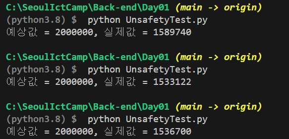

### 해결해야할 과제 
- Thread의 safety와 unsafety에 대해서 공부하고 스터디하여 메모하기
1. Thread-safety와 unsafety란 무엇인가?
2. 이러한 특성이 생기는 이유는 무엇인가?
---

### 멀티프로세스 와 멀티스레드


- 멀티 프로세스와 멀티스레드 프로그래밍은 컴퓨터 프로그램이 동시에 여러 작업을 처리할 수 있도록 하는 두 가지 주요기법.

#### 멀티프로세스
| 여러 독립적인 프로세스를 실행해 병렬 처리를 수행하는 방식
##### 장점
- 각 프로세스는 독립적인 메모리 공간을 갖기 때문에 서로에게 영향을 주지 않는다.
- 한 프로세스에서 오류가 발생해도, 다른 프로세스에는 영향을 미치지 않는다.
- 멀티코어나 멀티프로세서 환경에서 효과적으로 작동

##### 단점
- 프로세스간 통신(IPC)은 비교적 느리고 복잡함
- 프로세스 생성과 관리는 메모리와 시스템 리소스를 많이 사용함

#### 멀티프로세스 - 멀티코어
- 단일 프로세서 내에 여러개의 연산 코어가 포함된 것
- 각 코어는 독립적인 CPU로 동작 가능!
- 여러 작업을 동시에 처리할 수 있음

#### 멀티프로세스 - 멀티프로세서
- 컴퓨터 시스템 내에 여러 개의 독립적인 프로세서가 설치 된것
- 각 프로세서에는 자신만의 캐시와 메모리가 있음
- 고성능 작업에 적합. 큰 규모의 서버나 슈퍼컴퓨텅 사용됨!
---

#### 멀티스레드
| 단일 프로세스 내에서 여러 스레드를 실행해 병렬 처리를 수행

##### 장점
- 모든 스레드가 같은 메모리 공간을 공유함 스레드 간의 통신이 빠르고, 데이터 공유가 비교적 간단
- 프로세스에 대해 상대적인 리소스를 적게 사용 

##### 단점
- 메모리를 공유하기 떄문에 동기화 문제를 발생할 수 있음
- 한 스레드에서 발생하는 오류는 전체 프로세스에 영향을 줄 수 있음

---

### Thread Safety(스레드 안전성) 과 Unsafety(불안전성)

| 멀티스레드 환경에서 데이터 무결성과 시스템의 안정성을 유지하는 개념 

스레드의 단점 중, "메모리를 공유" 하기 때문에 문제가 생길 수 있다는 점과 연관되는 개념이다.

#### Thread Safety(스레드 안전성)

- 어떤 함수나 변수 혹은, 객체가 여러 스레드로부터 동시에 접근되어 사용될 때, 프로그램의 실행 순서에 따라 결과가 달라지지 않고 예상대로 동작한다면 "스레드 안전" 이라고 한다.

#### Thread Unsafety(스레드 불안전성)
- 여러 스레드가 동시에 접근할 수 있는 코드 영역이나 자원에서, 해당 코드나 자원에 대한 적절한 동기화 조치가 이루어지지 않아 에기치 않은 결과 초래할 수 있는 경우 "스레드 불안전" 하다고 한다.

### 스레드 불안정 상태가 나타나는 이유

#### 1. Race Condition (경쟁 상태)
- 두 개 이상의 스레드가 공유 자원을 동시에 접근하려고 할 때, 자원에 대한 접근 순서에 따라 결과가 달라질 수 있는 상황

#### 2. DeadLock
- 여러 스레드가 다양한 자원을 요청할 때, 스레드들이 서로 다른 스레드가 보유하고 있는 자원을 기다리며 무한히 대기하는 상황

#### 3. Starvation (기아 상태)
- 특정 스레드가 자원에 대한 접근 기회를 계속해서 얻지 못하고 대기 상태에 머무르는 현상
#### 4. Live-lock(라이브 락)
- 두 스레드가 다른 스레드의 작업을 기다리면서 서로의 작업을 중단시키는 상황
- 데드락과는 다르게 스레드는 활동적 하지만, 유요안 일은 수행하지 않는다.

#### 5.Improper Synchronization (부적절한 동기화)
- 동기화 메커니즘을 잘못 사용하거나 사용하지 않아서 발생하는 문제.
- 잘못된 락 사용, 락을 오랜 시간 동안 보유하는 것 등

---
### 불안전상태에 대한 파이썬 예제코드
```python
import threading

# 공유 변수
counter = 0

# 스레드에서 실행될 함수
def increment_counter():
    global counter
    for _ in range(1000000):
        counter += 1

# 두 개의 스레드 생성
thread1 = threading.Thread(target=increment_counter)
thread2 = threading.Thread(target=increment_counter)

# 스레드 시작
thread1.start()
thread2.start()

# 스레드가 종료될 때까지 기다림
thread1.join()
thread2.join()

# 두개의 스레드로 실행한 결과
print(f"예상값 = 2000000, 실제값 = {counter}")

```


- "increment_counter" 함수가 두 스레드에 의해 동시에 실행됨
- "counter" 변수는 두 스레드가 동시에 접근되기 때문에 "Race Condition" 상태가 발생
- 예상값과는 다른 결과를 나타낸다.