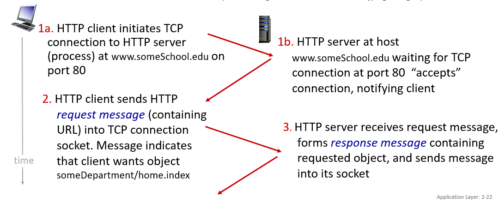
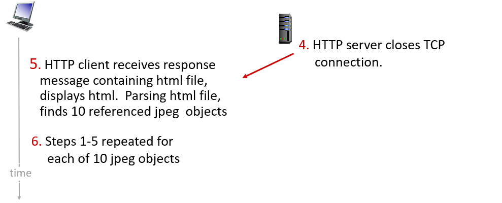
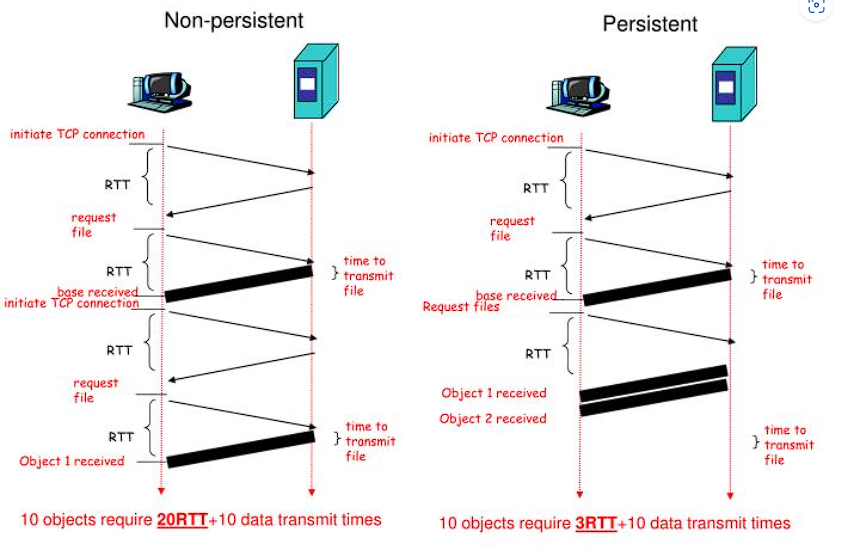

### 해결해야할 과제
HTTP 헤더에 부분에 Connection 키라는 값 중 Keep-alive라는 옵션이 있음. 이것이 무엇인지 http를 사용하는데 대한 역할과 어떤 상황에서 사용되는지 알아보기

---
본 과제는 RFC 7230 HTTP/1.1 를 토대로 작성되었습니다. 

---

### HTTP 란?
- WWW 상에서 정보를 주고받을 수 있는 프로토콜
- 주로 HTML 문서를 주고 받는 데 사용된다.

- HTTP는 클라이언트와 서버 사이에 이루어지는 요청/응답 프로토콜 

출처 : [위키백과](https://ko.wikipedia.org/wiki/HTTP) 

---

### HTTP와 TCP

- HTTP는 TCP를 통해 신뢰적인 데이터 전송서비스를 제공받으며
모든 HTTP 요청 메세지가 궁극적으로 서버에 도착한다.

---

### HTTP와 stateless 프로토콜

- 특정 클라이언트가 같은 객체를 두 번 요청해도 서버는 이전에 보냈다는 것을 기억하지 못하고 객체를 다시 보내게 된다.
- HTTP서버는 클라이언트에 대한 정보를 유지하지 않으므로, stateless 프로토콜 이라고 부른다.

---

### HTTP의 비지속 연결과 지속 연결

#### 비지속(Non-persitent) 연결 (HTTP/1.0)


출처 : [Network top down approach 8th slide]
[챕터2](https://gaia.cs.umass.edu/kurose_ross/ppt.php)

다음 설명은 웹 페이지를 서버에서 클라이언트로 전송하는 단계는 다음과 같다.
1. HTTP 클라이언트가 포트 80 를 통해 TCP 연결을 시도한다.
2. HTTP 서버는 80포트로 부터 TCP 연결을 기다리다가, 허용되었을 때 클라이언트에 알린다.
3. 클라이언트는 연결된 TCP 소켓으로 요청메세지를 날린다.
4. HTTP 서버는 요청메시지를 수신한 후, 요청한 객체와 함께 응답메시지를 보낸다.
5. **HTTP서버는 응답과 함께 TCP 연결을 끊으려고 한다**  
6. HTTP 클라이언트는 응답메시지를 받은 후, TCP 연결을 종료한다.
7. HTTP 클라이언트는 원하는 객체마다 1~6번 과정을 반복한다.

#### 지속(Persistent) 연결 (HTTP/1.1)
HTTP/1.1 지속연결에서는 서버는 응답을 보낸 후에 TCP연결을 그대로 유지한다.
이 후 **같은 클라이언트와 서버 간의 이후 요청과 응답은 같은 연결을 통해 보내지게 된다.**

---

### 비지속연결과 지속연결의 응답속도

[출처](https://www.slideserve.com/andra/chapter-2-powerpoint-ppt-presentation)

비지속연결과 지속연결은 응답속도 에서도 크게 차이가 난다.
이는 왕복시간을 의미하는 RTT(Rount-Trip-Time) 때문이다.

#### 비지속연결 RTT
- 각 HTTP 요청에 대해 새로운 TCP 연결 
- 각 연결 설정에는 3-way handshake 필요함 (초기설정 1RTT)
- 요청을 보내고 응답을 받는데 추가 RTT 필요 
- 따라서 최소 2RTT가 필요하다.
- 웹 페이지에 여러 객체가 있으면, 각 객체에 대해 2RTT씩 발생

#### 지속연결 RTT
- 초기 연결 설정 후 여러 HTTP 요청 응답을 동일한 TCP 연결을 통해 처리
- 초기 연결 설정에 1RTT
- 추가 연결 설정에 대한 RTT 필요없음!

만약 10개의 오브젝트가 존재한다면, 
- 비지속연결은  2RTT * 10(Object) + 10파일전송시간  = 20RTT + 10파일전송시간
- 지속연결은 1RTT + 1RTT * 10 (Object) + 10파일 전송시간 = 11RTT + 10파일전송시간

---

### HTTP 메시지 포맷

#### HTTP 요청메시지

출처 : [Network top down approach 8th slide]
[챕터2](https://gaia.cs.umass.edu/kurose_ross/ppt.php)

우리는 여기서 Header Lines를 살펴보겠다.

전형적인 HTTP 요청메시지는 다음과 같다.
```markup
GET /somedir/page.html HTTP/1.1
Host: www.someschool.edu
Connection: close
User-agent: Mozilla/5.0
Accept-language: fr
```
이 중 Connection 헤더를 살펴볼 필요가 있다.

---

#### HTTP 요청메시지 - Connection 헤더
- 클라이언트와 서버 간의 네트워크 연결의 제어를 위해 사용되는 헤더이다.

- "keep-alive" 와 "close" 속성은 각각 이 포스팅에서 설명하던 지속적인 연결과 비지속적인 연결을 의미한다.

- "keep-alive" : 연결을 지속적으로 유지하려는 속성
    - 연결이 얼마나 유지되어야 하는지, 최대 몇개의 요청이 해당 연결을 통해 전송될 수 있는지와 같은 매개변수를 지정할 수 있다.
    - "keep-alive: timeout=5, max=100"
        - 연결을 5초동안 유지하고 해당 연결을 통해 최대 100개의 요청전송을 하겠다는 뜻
- "close" : 연결을 요청 후 바로 종료하려는 속성

- HTTP/1.0 에서는 기본적으로 비지속 연결을 사용했다.
- HTTP/1.1 에서는 기본값이 keep-alive가 되었다. 
(비지속연결을 사용하려면 close 속성을 부여해야함)

---
### stateless 와 keep-alive

HTTP는 자체적으로 상태를 유지하지 않는 stateless 프로토콜이다.

이는 각 요청이 독립적이라는 뜻

HTTP의 stateless 특성은 요청 내용과 상태에 관한 것
Keep-alive는 연결 자체의 지속성에 관한 것

따라서 keep-alive와 stateless 특성은 다른 영역에 존재한다.

---