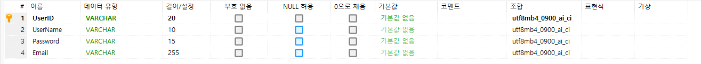
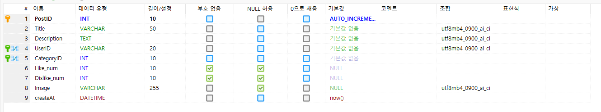
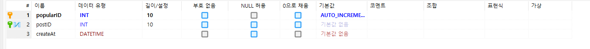
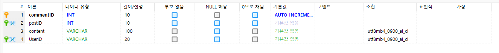
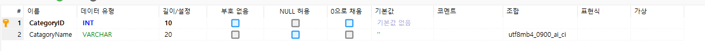
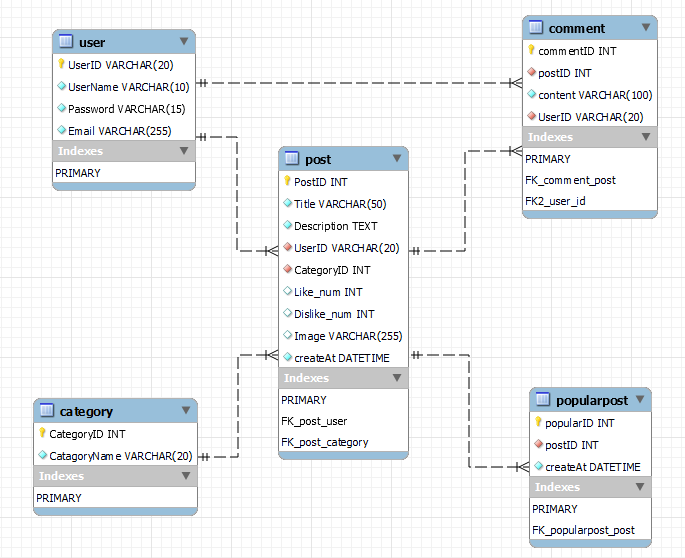

### 해야할 과제
ERD 고도화 및 정규화하여 제출하기

1. 테이블, 컬럼명 규칙에 맞게 재작성 (aka. 일종의 컨벤션을 잘 지켜서 일관성 있는 테이블과 컬럼 생성)
2. 컬럼마다 data type과 constraint 등을 보이도록 ERD의 이미지 파일을 만들어서 제출
3. 테이블의 primary key에 해당되는 index도 없으면 추가하여 만들 것

### User Table

- 기본키 : UserID (VARCHAR)
- 의도 : 사용자 계정관리, 중복된 아이디 생성불가 (기본키)

### Post Table 

- 기본키 : PostID (INT) , AutoIncrement
- 작성자(UserID , 외래키) -> 참조  User.UserID
- 카테고리(CategoryID , 외래키) -> 참조 Category.CategoryID

- 이미지 경로를 저장하기  위한 Image Attribute 생성 VARCHAR(255)
- 최근 하루간 게시글을 랜덤으로 띄우기 위해 createAt Attribute 생성 DATETIME

### Popular Table (인기글)

- 기본키 : PopularID (INT), AutoIncrement
- 원래 게시글(postID,외래키) -> 참조 Post.PostID

### Comment Table

- 기본키 : CommentID (INT)
- 댓글이 달린 게시글 (postID, 외래키) -> 참조 Post.PostID
- 댓글 작성자 (UserID, 외래키) -> 참조 User.UserID

### 카테고리 Table

- 기본키 : CategoryID (INT)

---
기본적으로 PK INT 형식의 경우 AutoIncrement 적용 (자동으로 1씩 올라 중복이 될일이 없다)

- 변한게 딱히 없는 DB...
---