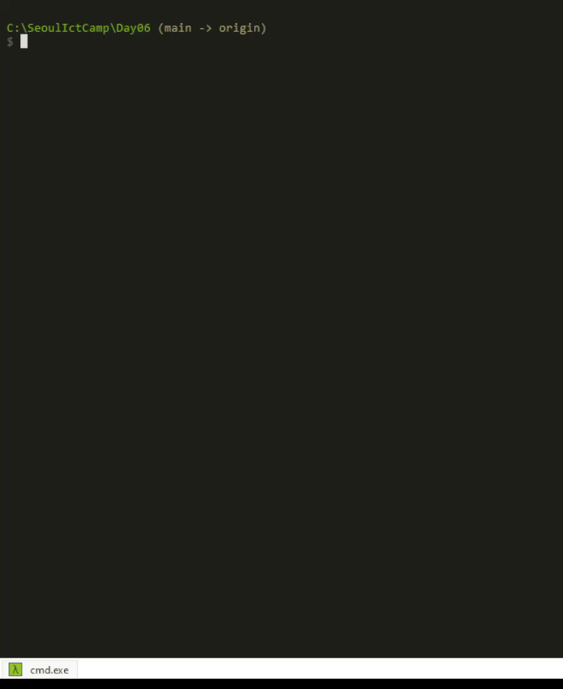

## 자바스크립트로 오목게임 만들어 보기

<aside>
💡 1. Nodejs와 함께 콘솔창에서 실행되도록 사용자 입출력 도구를 사용한다.
2. 오목판 사이즈는 30x30으로 고정한 후 정사각형의 형태의 오목판을 만든다.
3. 사용자 입력 도구에 좌표값 (15,15)라고 입력하여 바둑돌을 둔다.
4. 흑은 1로, 백은 0으로 표기하여 화면에 흑과 백이 번갈아 두도록 입력도구가 뜨도록 입력을 받는다.
5. 오목 규칙에 따라 5줄이 먼저 완성되면 “Game over” 와 같이 누가 이겼는지 승패를 알리는 출력을 만든다.
6. 승패가 계속 나지 않을 경우 실행 후 5분이 지나면 자동 종료 시킨다.

</aside>

### 오목판 배열 생성

```jsx
// 오목판 배열 생성 ---------------------
let Omok_Board = new Array(31);
for(let i = 0; i < 31; i++){
    Omok_Board[i] = new Array(31);
}
Omok_Board[0][0] = '┌'.padStart(2,' ')
```

- 돌을 둘수있는 공간 30x30 + 행과 열을 쉽게 판단하기 위한 영역 1행1열 을 포함할 [31][31] 배열 생성

### 오목판 초기화

```
for(let i = 0; i < 31; i++){
    Omok_Board[i] = new Array(31);
}
Omok_Board[0][0] = '┌'.padStart(2,' ')
for(let i = 1; i < 31; i++){
    let ASCII = 64 + i;
    if(ASCII > 90){
        Omok_Board[0][i] = String.fromCharCode(ASCII + 6).padStart(2,' ');
    }
    else{
        Omok_Board[0][i] = String.fromCharCode(ASCII).padStart(2,' ');
    }
    Omok_Board[i][0] = i.toString().padStart(2,' ');
}

for(let i = 1; i < 31; i++){
    for(let j = 1; j < 31; j++){
        Omok_Board[i][j] = '+'.padStart(2,' ');
    }
}
```

- 오목판의 초기 상태로 초기화 합니다.


- A~B , a~z 까지 1행에 넣기 위한 과정
- decimal 기준 65 ~ 90 까지 ASCII 로 대문자 알파벳에 해당합니다.
- 자바스크립트 기본으로 제공하는 String 객체의 “fromCharCode” 는 ASCII 넘버를 Number 로 변환해주는 method 를 제공합니다.
- 따라서 65 ~ 90 까지는 String.fromCharCode(ASCII)
- 91~95 까지는 String.fromCharCode(ASCII+6) 을 사용합니다.

```jsx
let result = String.fromCharCode(65);
console.log(result); // 출력: "A"
```

- .padStart( length , padStr ) 는 String method 중 하나.
- 문자열이 length 길이가 되도록 원래의 문자열 앞에 padStr 를 붙입니다.

```jsx
let str = "a"
console.log(str.padStart(3,"b")); // 출력 : "bba"
```

- 1열 역시 1~30 까지 string 변환 후 .padStart method로 **보기 쉽게** formatting 해준다.
- 나머지 영역 또한 ‘+’.padStart(2,’ ‘); 을 사용한다.

### Player의 차례를 판단

```jsx
function func_is_black_turn(){
    return count % 2 ? 1 : 0;
}
```

- 삼항 연산자를 사용
- 전역 변수로 정의된 count 를 moduler 연산을 통해 player의 순서를 정의할 수 있다.

### 돌 놓기

```jsx
function func_placeStone(_inputX,_inputY){
    if(!(Omok_Board[_inputY][_inputX] == ' +')){    // 이미 돌이 존재하면
        func_set_indicator("already_placed");
        return 0;
    }
    else{
        Omok_Board[_inputY][_inputX] = nowPlayer;
        count++;
        func_set_indicator("placeOmok", _inputX, _inputY);
        return 1;
    }
}
```

- 오목판 Omok_Board 의 저장된 값이 ‘ +’ 인지 아닌지로 판단.
- 만약 ‘ +’ 이 아니라면 해당 지점에 이미 돌이 존재한다는 것을 의미

### 오목 판단

```
const direction = [[-1, 0], [-1,1], [0,1], [1,1], [1, 0], [1,-1], [0,-1],[-1, -1]];

function func_isOmok(_inputX, _inputY){
    let omokCount = 0;
    let curX;
    let curY;
    let OmokCountArray = new Array(4);
    for(let i = 0; i < 4; i++){
        omokCount = 0;
        curY = _inputY;
        curX = _inputX;
        while(curY > 0 && curY < 31 && curX > 0 && curX < 31 && nowPlayer == Omok_Board[curY][curX]){
            curY += direction[i][0];
            curX += direction[i][1];
            omokCount += 1;
        }
        omokCount -= 1; // 방금 돌을 둔 곳은 위에서 ++ 했으므로
        curY = _inputY;
        curX = _inputX;
        while(curY > 0 && curY < 31 && curX > 0 && curX < 31 && nowPlayer == Omok_Board[curY][curX]){
            curY += direction[i + 4][0];
            curX += direction[i + 4][1];
            omokCount += 1;
        }
        OmokCountArray[i] = omokCount;
        if(omokCount == 5){
            func_set_indicator("win");
            return 1;
        }
    }
    func_set_indicator("isOmok", _inputX, _inputY, OmokCountArray);
    return 0;
}
```

- for 문을 통해 4방향을 판단하기 위해 direction 배열을 생성
- for 문이 i = 0 ~ 3 까지 진행하면서 nowPlayer가 판단할 위치 Omok_Board의 값과 같은지를 비교한다.

### 오목판 출력하기

```jsx
function func_print_Omok_Board(){
    console.clear();
    for(let i = 0; i < 8 ; i++){
        console.log(Indicator_Section[i]);
    }
    let boardLine = "";
    for(let i = 0; i < 31; i++){
        boardLine = "";
        for(let j = 0; j < 31; j++){
            boardLine += Omok_Board[i][j];
        }
        console.log(boardLine);
        
    }
}
```

### 입력 받기

### 

```jsx
r1.on('line',(input) => {
    const parsedInput = input.slice(1,-1).split(',');

    let inputX_str = parsedInput[0];
    let inputY_str = parsedInput[1];
    inputX_str = inputX_str.charCodeAt(0);  // ASCII to Number
    
    const inputX = (inputX_str >= 65 && inputX_str <= 90) ? inputX_str - 64 : inputX_str - 96 + 26; // Input X 는 A~Z a~e 까지 1~30 으로 매핑
    const inputY = parseInt(inputY_str);

    prevPlayer = func_is_black_turn() ? ' ○' : ' ●';
    nowPlayer = func_is_black_turn() ? ' ●' : ' ○';

    if(func_placeStone(inputX,inputY)){
        func_isOmok(inputX, inputY);
    }
    func_print_Omok_Board();
})
```

- 입력을 받을 때 마다 실행되는 함수
- 사용자 입력이 (A, 1) 형식으로 주어지기 때문에
- 맨 앞과 맨 뒤 괄호를 slice로 없애고, split(’,’) 으로 나눠 줍니다.
