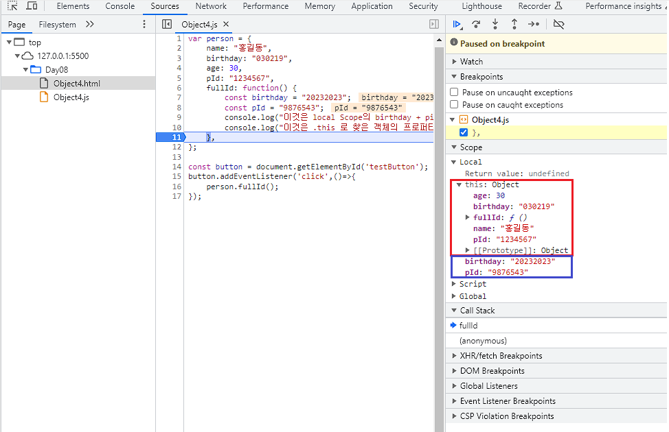

# 23-07-26 과제

<aside>
❓

**과제 7월 26일주제**

1. object를 만들때 fullId 메서드를 호출한 적이 없는데 왜 호출될까 원인 찾아보기
2. this. 를 안 붙이면 reference Error가 뜨는데 위에 선언을 했음에도 불구하고 왜 에러가 뜨는지 원인 찾아보기

**예시코드**

```jsx
var person = { 
name: “홍길동“, // 이름 프로퍼티를 정의함. 
birthday: “030219”, // 생년월일 프로퍼티를 정의함. 
age: 30, pId: “1234567", // 개인 id 프로퍼티를 정의함. 
fullId: function() { // 생년월일과 개인 id를 합쳐서 주민등록번호를 반환함. 
		return this.birthday + this.pId; },
};
```

</aside>

- **“스코프”** 라는 변수의 생명 주기가 존재한다.
- **“스코프”** 란 변수가 생성되어 소멸되기 까지의 범위이다.
- 변수나 함수가 접근 가능한 영역이며, 그 범위에 따라 변수나 함수의 이름이 유일해야 하는 범위이다.

- JavaScript 에서는 전역스코프와 지역스코프로 구분된다.
    1. 전역 스코프 : 어디에서나 접근 가능하며, 웹 페이지나 프로그램이 닫힐 때 까지 존재한다.
    2. 지역 스코프 : 특정 함수 내에서만 접근 가능한 변수. 해당 함수다 호출될 때 까지 생성되고, 함수 실행이 끝나면 소멸된다.

- JavaScript 에서 변수는 찾는 방법은 다음과 같다.
    1. 현재 함수의 로컬 스코프에서 찾는다.
    2. 해당 스코프에서 변수를 찾을 수 없으면 한 단계 상위의 스코프로 올라간다.
    3. 이 과정을 반복해 해당 변수를 찾을 수 있는지 검사한다.
    4. 가장 상위 스코프 (전역 스코프) 에서도 찾을 수 없다면, 
    변수가 정의되지 않았다는 오류 (ReferenceError) 가 발생한다.
    
- 이때, 객체 person 에 정의되어 있는 프로퍼티 birthday와 pid 는 변수를 찾는 과정에 해당되지 않는다.
- 객체의 프로퍼티를 찾는 과정은 객체 내부에서 진행되며, 이 때 사용되는 것이 **“this”** 키워드 이다.
- ‘this’ 는 메서드가 호출한 객체를 가리키며, 객체의 프로퍼티에 접근 가능하다.

<aside>
💡 ‘this’ 를 생략하면 JavaScript 는 변수를 찾는 과정을 수행하고.
이 과정에서 해당 프로퍼티를 찾을 수 없으므로 Reference Error가 발생한다.
그렇기 떄문에 객체의 프로퍼티에 접근하려면 ‘this’ 키워드가 반드시 필요하다.

</aside>

---

### 예제 코드1

```jsx
var person = {
    name: "홍길동",      // 이름 프로퍼티를 정의함.
    birthday: "030219",  // 생년월일 프로퍼티를 정의함.
    age: 30,
    pId: "1234567",      // 개인 id 프로퍼티를 정의함.
    fullId: function() { // 생년월일과 개인 id를 합쳐서 주민등록번호를 반환함.
        return birthday + pId;  // this 연산자가 없음.
    },
};

console.log(person.fullId());
```

- 객체 person 의 method fullId()는 this. 키워드가 없는 변수 birthday 와 pId를 찾고 있다.
- 하지만 fullId 의 스코프 ( 함수(지역) 스코프 ) 와 상위 스코프 (이 경우 전역 스코프) 에 birthday와 pid 변수가 존재하지 않으므로 ReferenceError 가 발생한다.

### 예제 코드2

```jsx
var person = {
    name: "홍길동",      // 이름 프로퍼티를 정의함.
    birthday: "030219",  // 생년월일 프로퍼티를 정의함.
    age: 30,
    pId: "1234567",      // 개인 id 프로퍼티를 정의함.
    fullId: function() { // 생년월일과 개인 id를 합쳐서 주민등록번호를 반환함.
				// 로컬 스코프의 변수를 찾음을 알기 위한 로컬변수 생성
				// 객체의 프로퍼티와 같은 변수명을 사용해도 상관없음.
        const birthday = "20232023";
        const pId = "9876543";
        console.log("이것은 local Scope의 birthday + pid 입니다",birthday, pId);
        console.log("이것은 .this 로 찾은 객체의 프로퍼티 입니다.",this.birthday + this.pId);
    },
};
person.fullId();

// 출력결과
/*
  이것은 local Scope의 birthday + pid 입니다 202320239876543
  이것은 .this 로 찾은 객체의 프로퍼티 입니다. 0302191234567
*/
```

- 코드를 조금 수정하여 fullId method 함수에 지역 변수 birthday 와 pId를 추가하였다.
- fullId method 함수에 정의되어 있는 변수 birthday와 pId를 찾을 수 있고, this. 키워드를 통해 객체 프로퍼티를 찾을 수 있다.

```jsx
const birthday = "20232023";
const pId = "9876543";

var person = {
    name: "홍길동",      // 이름 프로퍼티를 정의함.
    birthday: "030219",  // 생년월일 프로퍼티를 정의함.
    age: 30,
    pId: "1234567",      // 개인 id 프로퍼티를 정의함.
    fullId: function() { // 생년월일과 개인 id를 합쳐서 주민등록번호를 반환함.
        console.log("이것은 local Scope의 birthday + pid 입니다",birthday + pId);
        console.log("이것은 .this 로 찾은 객체의 프로퍼티 입니다.",this.birthday + this.pId);
    },
};
person.fullId();
// 출력결과
/*
	이것은 local Scope의 birthday + pid 입니다 202320239876543
	이것은 .this 로 찾은 객체의 프로퍼티 입니다. 0302191234567
*/
```

- birthday 와 pId 를 전부 상위 스코프 (전역 스코프) 에 정의 해도 변수 사용이 가능하다.

### 예제 코드4

- 브라우저의 디버깅 도구를 사용해 this의 동작을 알 수 있다.

```html
<!DOCTYPE html>
<html>
<head>
    <title>Object4</title>
</head>
<body>
    <button id="testButton">testButton</button>
    <script src="Object4.js"></script>
</body>
</html>
```

```jsx
var person = {
    name: "홍길동",
    birthday: "030219",
    age: 30,
    pId: "1234567",
    fullId: function() {
        const birthday = "20232023";
        const pId = "9876543";
        console.log("이것은 local Scope의 birthday + pid 입니다",birthday + pId);
        console.log("이것은 .this 로 찾은 객체의 프로퍼티 입니다.",this.birthday + this.pId);
    },
};

const button = document.getElementById('testButton');
button.addEventListener('click',()=>{
    person.fullId();
});
```


- 테스트를 하기 위한 간단한 HTML 파일과 JS 파일이다. (js 파일을 Object2.js를 재활용 하였다.)
- 이 HTML 문서엔 Button을 하나 생성하고 해당 버튼을 누르면 person.fullId가 실행된다.
    1. 크롬 브라우저에서 F12를 누르고 Source 탭을 누른다.
    2. Object4.js 파일을 선택 한 후 fullId method가 끝나는 지점에 라인넘버 옆을 눌러 중단점을 생성한다.
    3. Scope 영역에 찍히는 this. 에 어떤 값이 존재하는지, Local 영역에 어떤 값이 존재하는지 확인 할 수 있다.