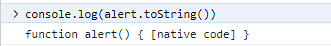

### 해결해야할 과제
  
- webAPI의 dialog box인 alert(), confirm() 메소드는 window나 document 없이 바로 사용할 수 있는 이유 찾아보기

### 

웹 개발에서 자바스크립트를 통해 HTML 요소를 조작하거나 상호작용 하기 위해선
'document' 또는 'window' 등의 키워드가 필요하다..

하지만 'alert()' 와 'confirm()', 'prompt()' 등은 키워드 없이 직접 호출가능한데 왜 그런것일까?

### window 객체의 메소드

사실 alert() 와 confirm(), prompt() 메소드는 'window' 객체의 메소드 이다.


그럼에도 window 키워드를 생략하고 호출가능한데, 이는 자바스크릅트의 전역 범위 작동 방식 때문이다.

웹 브라우저 환경에서는 'window' 객체가 전역 객체가 되므로, 'window' 객체의 속성과 메소드는 자동으로 전역 변수와 함수가 된다.

따라서 'window'를 생략하고 직접 호출이 가능한 것

### 자바스크립트 디버깅/콘솔 로 알아보기

자바스크립트의 'toString()' 함수를 이용해 어떤 객체에 속해있는지 확인 할 수 있다.
```javascript
console.log(alert.toString);
```


'alert' 는 네이티브 코드로 구현된 함수를 확인할 수 있다.

```javascript
console.log(window.alert === alert); // 출력 true
```

'window' 객체의 'alert' 속성과 전역 범위의 'alert' 함수가 같은 것을 확인할 수 있다.

```javascript
console.log(document.alert === undefined) // 출력 true
```

'alert' 함수가 'document' 객체의 메소드가 아니라는 것을 의미한다.

### 서버사이드 자바스크립트 환경에선 다르다.

서버 사이드 자바스크립트 환경인 Node.js 에선 전역 객체가 'global' 이다.

브라우저 환경에서 'window' 와 마찬가지로 'global' 객체의 속성을 전역 변수나 함수로 사용할 수 있을 것이다.

'alert' 나 'confirm' 등은 웹 브라우저 환경에 특화된 메소드 이기 때문에 'global' 객체에 존재하지 않다.


node js 콘솔로 alert를 실행해보면 정의되지 않았을 때의 오류인 ReferenceError를 뱉는 것을 볼 수 있다. 

