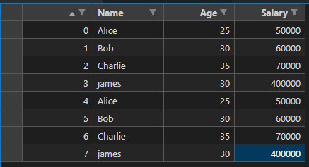
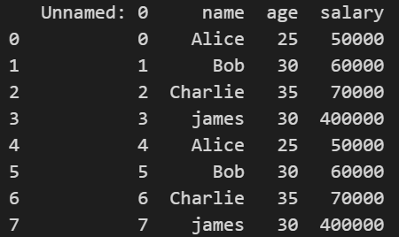
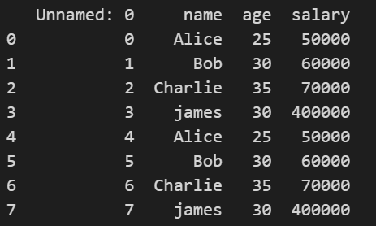
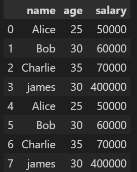
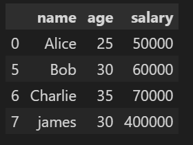
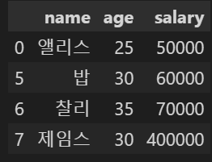
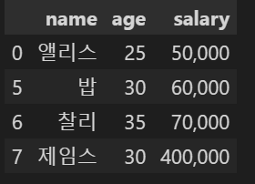

### 해결해야할 과제
- pandas로 my_data.csv를 수정하여 저장하기
  
요구사항
1. Unnamed:0라고 표기되는 열을 지운다. 단 Unnamed:0라 쓰지말고 새롭게 컬럼 이름을 만들어서 지운다.
2. 0,1,2,3,4로 보여지는 index 부분을 지운다.
3. name에 해당되는 영문 이름을 한글로 바꾼다.
4. salary에 해당되는 숫자를 000 세자리 단위로 콤마를 넣어서 값을 바꿔 넣는다.
5. 1~4를 처리하고 나서 csv파일로 저장한다.
---
### CSV 파일 불러오기



- 주어진 CSS 파일은 다음과 같다.
- 1행엔 Column의 라벨이 적혀져있고 1열은 인덱스번호가 적혀져있다.
- 그렇기 때문에 가장 왼쪽위 모서리는 아무것도없는 빈공간으로 표현되어 주어졌다.



```python
import pandas as pd

df = pd.read_csv("my_data.csv")
print(df)
``` 
- pd.read_csv() 함수는 csv 파일을 불러올 수 있다.
- 함수 인자에 파일의 경로를 지정하고, sep='문자' 인자를 통해 어떤 문자로 구분할건지 정할 수 있다. 
- csv 파일은 기본적으로 ',' 로 구분되어 있는 파일이고, read_csv() 의 디폴트 구분자는 ',' 
  


- 가장 왼쪽위 아무 값이 없던 공간은 Unnamed: 0 으로 자동으로 할당되었다.
---
### Label 이름 변경하기
```python
df.rename(columns={"Unnamed: 0":"id"},inplace=True) # inplace 옵션은 True : 원본에 영향, False : 복제 생성
```
- dataframe.rename() method 는 column 또는 index의 이름을 재설정하는 method 이다. columns={dict} 는 dict 의 정보를 토대로 Label을 변경할 수 이다.
- inplace 옵션은 원본 dataframe에 영향끼침의 여부에 대한 설정이다.
  


### Label 부분을 지우기.
```python
df.drop(['id'],axis=1,inplace=True)                 # axis = 0 : data freme의 row 삭제     첫번째 인자는 index 의 value가 됩니다.
                                                    # axis = 1 : data frame의 column 삭제  첫번째 인자는 label
                          
df.drop([x for x in range(1,5)],axis=0,inplace=True)
```
- dataframe.drop() method는 행 또는 열에 해당하는 라벨을 지우는 method 이다.
- 첫번째 인자는 지울 index 또는 column label이 들어가며 
- axis 인자를 통해 행을 지울것인지, 열을 지울것인지 정할 수 있다.
  - 0 : row, 1 : column
- 1~4 번 index를 지우기 위해 List Comprehension을 통해 [1,2,3,4] list를 생성해 drop 하였다.
  


### name에 해당되는 영문 이름을 한글로 바꾸기

``` python
korean_name_dict = {"Alice":"앨리스",
                    "Bob": "밥",
                    "Charlie":"찰리",
                    "james":"제임스"}

df["name"] = df["name"].replace(korean_name_dict)
```
- 영문 이름을 한글이름으로 바꾸기 위해 dict 를 만들었다.
- dataframe.replace() method는 value를 대체하는 method 이다.
  


### salary에 해당되는 숫자를 000 세자리 단위로 콤마를 넣어서 값을 바꾸기

```Python
df["salary"] = df.apply(lambda x: "{:,}".format(x["salary"]), axis=1)
```

- apply() method는 dataframe의 각 행또는 열에 함수를 적용하는 역할을 한다.
- {:,} 는 문자열을 포맷팅하는 스펙중 하나이며 1000 단위 마다 ',' 를 넣어 포맷팅을 완성한다.



### csv 파일로 저장
```python 
df.to_csv("result.csv",index=False)
```
- to_csv method를 통해 파일로 저장한다.
- index=False 로 바꿈으로써 인덱스가 보이지 않게 만든다.