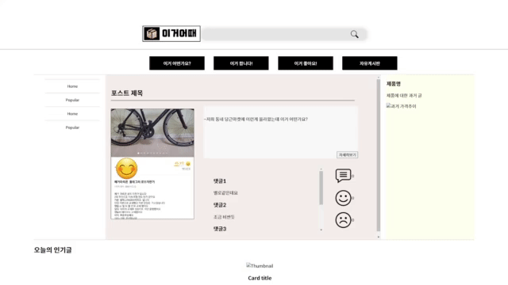

## 진행상황

- 레이아웃 구조 수정
    - post-section 내부에 대한 레이아웃이 수정되었습니다. 

- 코드분별을 위한 파일정리 작업

- Modal 사용을 위한 js 파일 생성 js/modal.js

- 좋아요/싫어요 사용을 위한 js 파일 생성 js/like_dislike.js

## 해야하는 것

- 댓글 Form 생성
- right-aside 내용 추가
- 오늘의 인기글 추가 
- 더미코드 삭제 ( 이것저것 한번에 하려다 보니 쓸데없는 요소들이 너무 많아짐 )

- 사실 이 모든 것은 데이터베이스 + 백엔드 적인 요소가 좀 있어서 배우고 생각해봐야할 듯