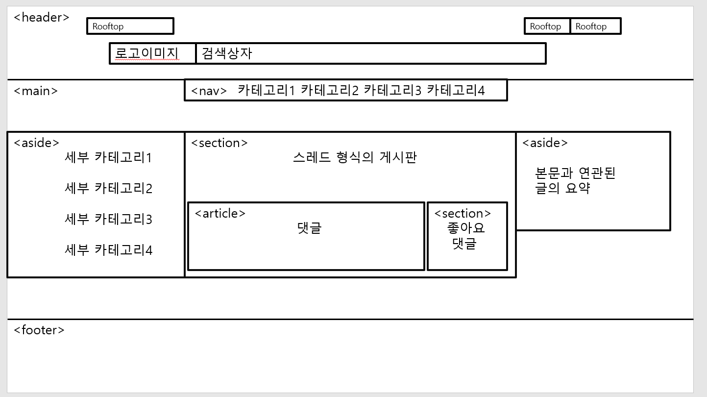
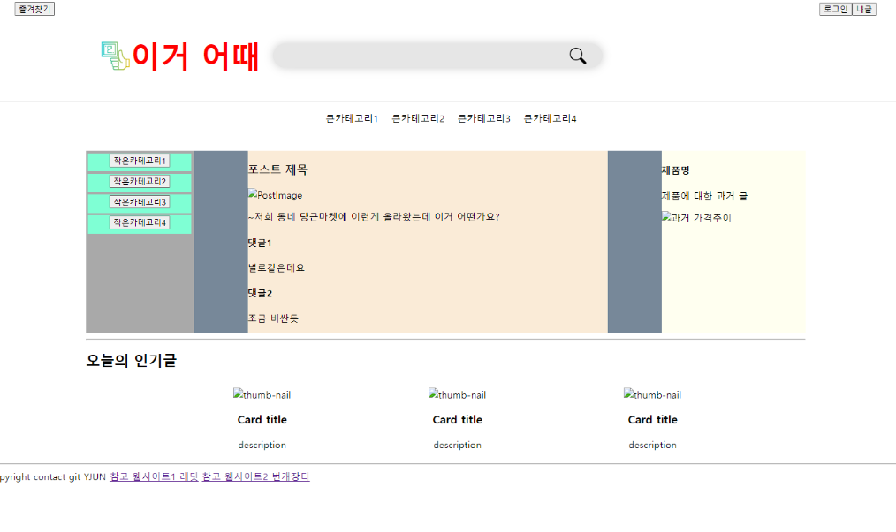
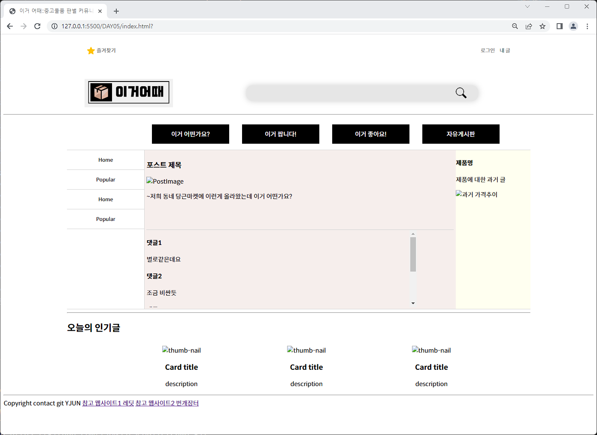
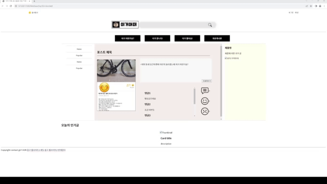

## [NIPA] AI+웹개발 취업캠프 SW 기초역량 강화 1~3주차 진행과정
---
### Day1 

### 내가 만들고 싶은 웹사이트의 메인페이지 레이아웃 잡아보기

#### 과제를 듣자 마자 한 생각
기존에 존재하는 웹사이트를 그대로 클론코딩 하는 것보다는 참고를 하고, 새로운 서비스를 제공하는 웹페이지를 만들어 보자

#### 주제선정
- 최근 중고거래 시장규모가 확장되고 있다.
- 구매자는 중고물품의 가치를 제대로 알지 못하는 경우가 많다
- 커뮤니티/게시판 처럼 여러 사람과 대화를 나눌 수 있되 ,
유튜브 쇼츠등의 스크롤 뷰, 레딧 등의 스레드 처럼 운영해보자!

- header와 main, footer 부분을 나누어
- 각 섹션별 레이아웃을 잡는 작업을 진행했다.

---

### Day2

### 내 웹사이트의 메인페이지의 레이아웃을 HTML과 CSS를 활용해 꾸미기

- 대략적인 레이아웃을 HTML 과 CSS를 통해 틀만 잡아보았다.

---

### Day3

### 내 웹사이트 고도화 작업 진행하기

- 한층 디자인적으로 업그레이 되었다.

---

### Day4
### Web-API를 이용해 웹사이트의 기능을 구현하기

- 웹사이트의 내용을 확대해서 보여주는 Modal 작업 진행
- 좋아요와 싫어요 버튼을 누르면 개수가 증가하는 이벤트 생성

### Day5
### SQL의 CRUD 와 파이썬의 Flask & PymtySQL을 이용해 DB와 연동 후 SELECT, INSERT 구문의 코드를 작성해 HTML문서에 데이터를 넘겨보는 작업 하기

